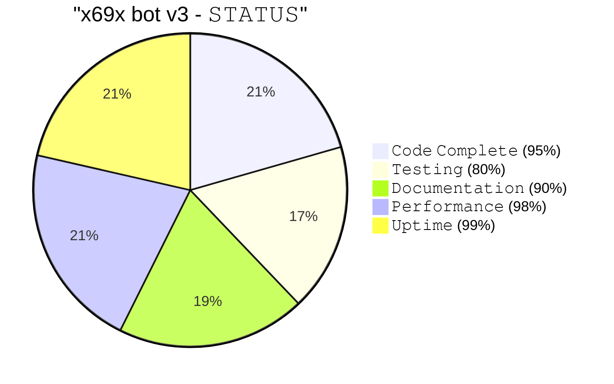

<div align="center">


</div>


[](https://git.io/typing-svg)
[](https://git.io/typing-svg)
[](https://git.io/typing-svg)

<p align="center">
  <a href="https://github.com/ncazad/X69X-BOT-V3">
    
  </a>
  <a href="https://github.com/ncazad/X69X-BOT-V3/forks">
    
  </a>
  <a href="https://github.com/ncazad/X69X-BOT-V3">
    
  </a>
  <a href="https://profile-counter.glitch.me/ncazad/count.svg">
     
  </a>
</p>
<p align="center">
  
</p>

<hr style="border: 2px solid #FF00FF; border-radius: 5px;">

<div align="center">

<a href="https://github.com/ncazad/X69X-BOT-V3/fork">
  
</a>

</div>

### 📈 **𝙻𝙴𝚅𝙴𝙻 𝙿𝙴𝚁𝙼𝙸𝚂𝚂𝙸𝙾𝙽𝚂**

<div align="center">

|   𝙻𝚎𝚟𝚎𝚕  |    Access Tier       | Description       |
|----------|--------------------|-----------------|
| **0 👥** | Standard User       | 𝙽𝚘𝚗𝚎            |
| **1 ⚔️** | Group Admin         | 𝙼𝚘𝚍𝚎𝚛𝚊𝚝𝚎       |
| **2 🤖** | Vip user            | 𝙰𝚍𝚟𝚊𝚗𝚌𝚎𝚍       |
| **3 💎** | Premium User        | 𝙿𝚛𝚎𝚖𝚒𝚞𝚖        |
| **4 👑** | Admin bot           | 𝙵𝚞𝚕𝚕 𝙰𝚌𝚌𝚎𝚜𝚜  |
| **5 🔧** | Developer           | 𝙷𝚒𝚐𝚑 𝙿𝚎𝚛𝚖𝚒𝚜𝚜𝚒𝚘𝚗 |
| **6 👑** | Creator             | 𝙷𝚒𝚐𝚑𝚎𝚜𝚝 𝙰𝚌𝚌𝚎𝚜𝚜 |

</div>

---

### ⚙️ **Command Structure**

```bash
module.exports = {  
  config: {  
    name: "command_name",                // 🔹 Command Name  
    version: "1.0",                      // 🔸 Version  
    author:"Azadx69x",                   // 👨‍💻 Developer  
    role: 6,                             // 🔐 full Access system
    usePrefix: true,                     // ⛓️ prefix Requirement  
    description: "Command Description",   // 📝 Functionality  
    guide: "Usage Guide",                // 📘 Command Syntax  
    category: "Utility",                 // 🧰 Function Category  
    cooldowns: 3                         // ⏳ Execution Delay (seconds)  
  }  
};

```
---

🪪 Connect & Support 

<p align="center">
  <a href="https://www.facebook.com/profile.php?id=61588403646276">
    
  </a>
</p>

---
🗃️ Credits

🏆 Original Creator:
- 👨‍💻 NTKhang03 — Goat-Bot-V2

👑 Modified By:
- 👨‍💻 Azadx69x — X69X-BOT-V3
---

📜 𝙻𝙸𝙲𝙴𝙽𝚂𝙴

```text
🤖 X69X BOT V3 
The MIT License (No Derivatives)

Copyright (c) 2022, NTKhang (NTKhang03)
update by Azadx69x

Permission is hereby granted, free of charge, to any person obtaining a copy
of this software and associated documentation files (the "Software"), to deal
in the Software without modification, including without liation the rights
to use, copy, modify, merge, publish, distribute, sublicense, and/or sell
copies of the Software, and to permit persons to whom the Software is furnished
to do so, subject to the following conditions:

The above copyright notice and this permission notice shall be included in
all copies or substantial portions of the Software.

NO DERIVATIVES: This license does not allow for any modifications or derivative
works based on the Software.
```
---

📊 𝙿𝚁𝙾𝙹𝙴𝙲𝚃 𝚂𝚃𝙰𝚃𝚄𝚂

<div align="center">



</div>

---

## 📶 GitHub Stats


<p align="center">
  
</p>

<p align="center">
  <a href="https://github.com/ncazad">
    
  </a>
</p>

<p align="center">
  
</p>

<br/>

---

<div align="center">

💫 THANK YOU FOR USING! 🖤

---
